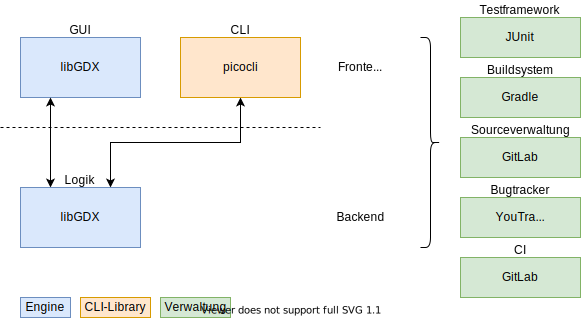

# Architektur

In diesem Verzeichnis liegen alle Dokoumente, die im Zusammenhang mit der Softwarearchitektur Mecha-Wars' stehen.

## Softwarestack



- [OpenJDK 11 LTS](https://adoptopenjdk.net) (die aktuelleste Version 16 wird von libGDX nicht unterstützt)
- [Gradle 6.7.1](https://gradle.org)
- [JUnit 5](https://junit.org/junit5/)
- [libGDX](https://libgdx.com) mit dem [lwjgl3 Backend](https://gist.github.com/crykn/eb37cb4f7a03d006b3a0ecad27292a2d). Das wird in nächster Zeit sowieso der Standard und das lwjgl2 Backend macht bei mindestens zwei Projektteilnehmern Probleme.
- [picocli](https://picocli.info)

## CI Pipeline

- **build**: ```gradle --build-cache assemble```
- **test**: ```gradle check``` (führt JUnit5, [stylecheck](https://checkstyle.org) und [spotbugs](https://spotbugs.github.io) aus)

## Dokumentation und Tutorials

### Gradle

- [Installation](https://gradle.org/releases/#6.7.1) -> Es ist keine eigene Installation notwendig, da Gradle schon in der libGDX-Installation enthalten ist.
- [offizielle Dokumentation](https://docs.gradle.org/6.7.1/userguide/userguide.html)
- ["Building Java Applications Sample" - Tutorial](https://docs.gradle.org/6.7.1/samples/sample_building_java_applications.html)

### libGDX

- [Installation](https://libgdx.com/dev/setup/) -> Die komplette Strecke ist für den Einstieg gedacht (von *Set Up a Dev Environment* bis *A Simple Game*)
- [offizielle Dokumentation](https://libgdx.com/dev/)
- [offizielles Wiki](https://github.com/libgdx/libgdx/wiki)
- [Liste von libGDX-Ressourcen](https://github.com/rafaskb/awesome-libgdx#read)
- [lwjgl3 Backend](https://github.com/libgdx/libgdx/tree/master/backends/gdx-backend-lwjgl3/src/com/badlogic/gdx/backends/lwjgl3)
- [libgdx.info](https://libgdx.info) - Ein Haufen einfacher Tutorials zu häufigen Problemen und Anwendungen. Sehr zu empfehlen!

### JUnit

- [User Guide](https://junit.org/junit5/docs/current/user-guide/)
